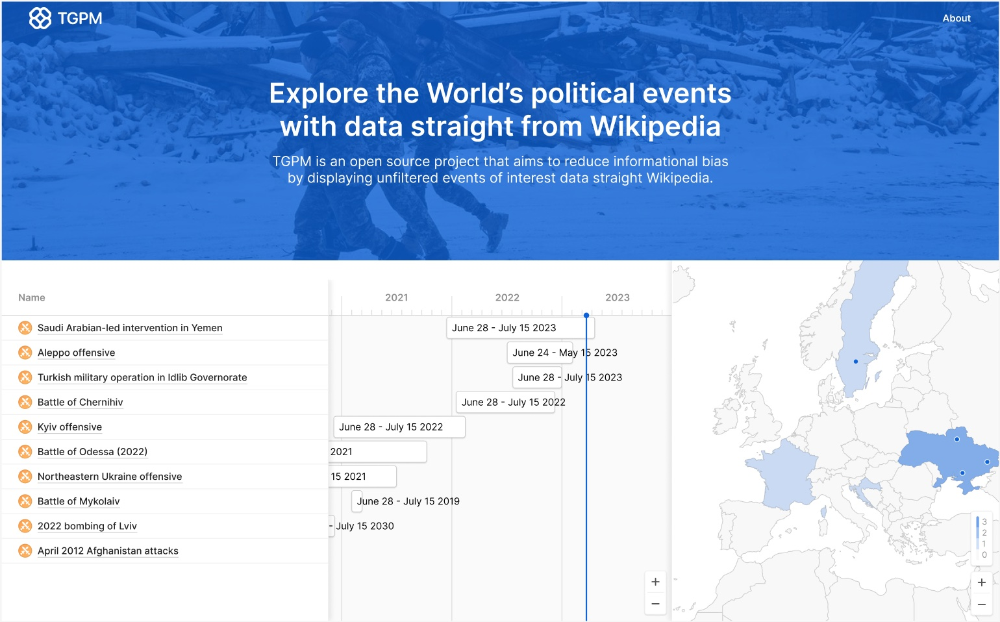

## TL;DR

Open source web application to view international political events.

## About

TempoGeoPoliticalMap is an open source web application which allows users to get data for historical and/or ongoing
international political events and view it in a usable way where different aspects are linked together -- temporal and
spatial. This includes international organisations, military alliances, military coups, multinational military
coalitions, national elections, political conferences, political crises, political murders, sources of international
law, supranational unions, warfare and armed conflicts etc. WikiData is a single source of truth and hence the data
source for this web application, which serves exclusively for presentation purposes to improve the UX and create
additional value.

## URLs

* **Web**([^1]): https://tgpm.world
* **API**([^1]): https://api.tgpm.world
* **Documentation**: https://docs.tgpm.world
* **Repository**: https://github.com/TempoGeoPoliticalMap
* **Development**: https://github.com/orgs/TempoGeoPoliticalMap/projects/1

[^1] _As the cheapest service is currently used for deployments, the 'cold' start-up may sometimes take up to 2
minutes._

## Latest Release

This is the Proof of Concept which alredy fetches data directly from the WikiData (see the Architecture
Diagram [below](#solution-architecture))

## Next Target Release

_**Note**: Examples of Future events: Planned Elections, Effective Date of signed Laws and Agreements, etc._

### Contribution to the next Release

If you want to contribute to the Project, see the Dev Board and choose a task
at https://github.com/orgs/TempoGeoPoliticalMap/projects/1

## Solution Architecture

For more details
see [1. Solution Architecture](1.%20Technical%20Design/1.%20Solution%20Architecture/TempoGeoPoliticalMap%20System/HOME.md)

